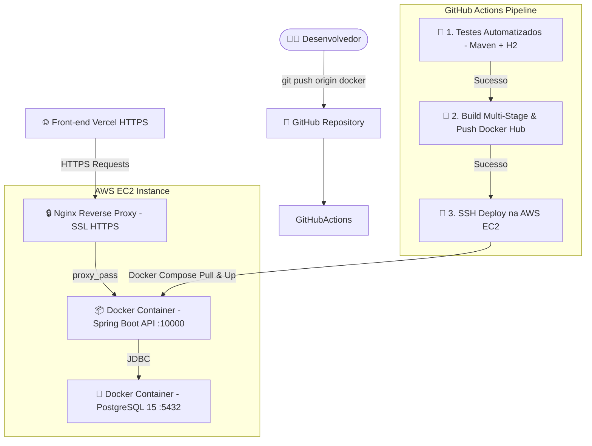

# 📦 Estoque & Gestão — Backend API

[](https://www.oracle.com/java/)
[](https://spring.io/projects/spring-boot)
[](https://www.postgresql.org/)
[](https://www.docker.com/)
[](https://aws.amazon.com/)
[](https://github.com/features/actions)
[](https://buscapestoque.duckdns.org/swagger-ui/index.html)

API RESTful robusta e de alta performance desenvolvida para o gerenciamento de estoque, categorias e controle financeiro de devedores para pequenos e médios comércios. O sistema conta com isolamento multilocatário por usuário, autenticação JWT, automação completa de CI/CD e implantação segura em nuvem.

---

## 🎯 Principais Funcionalidades

### 🔐 **Autenticação & Segurança**
- **Autenticação Stateless (JWT):** Geração e validação de tokens seguros HMAC256 com fuso horário UTC.
- **Controle de Acesso por Perfil (RBAC):** Restrição granular de rotas por perfis (`ROLE_USER` e `ROLE_ADMIN`).
- **Criptografia Criptográfica:** Hashing seguro de senhas via `BCryptPasswordEncoder`.
- **Proteção CORS Configurável:** Suporte nativo a origens dinâmicas no Vercel (`https://*.vercel.app`) e ambientes locais.

### 📦 **Gerenciamento de Produtos & Estoque**
- **CRUD Completo de Produtos:** Cadastro, atualização, consulta e exclusão por usuário.
- **Cálculo Automático de Status:** Definição dinâmica do status de estoque (`Disponível`, `Estoque Baixo` e `Sem Estoque`).
- **Filtros e Sumários:** Endpoints dedicados para listagem de produtos com baixo estoque, sem estoque e contadores sumarizados.

### 🏷️ **Categorias de Produtos**
- **Organização por Categoria:** Associação de produtos a categorias personalizadas.
- **Validação de Integridade Referencial:** Proteção contra exclusão acidental de categorias com produtos associados.

### 💰 **Gestão de Devedores (Financeiro)**
- **Controle de Contas a Receber:** Cadastro de clientes devedores, descrições, datas (UTC) e valores.
- **Filtros por Nome & Sumários:** Pesquisa parcial de devedores e cálculo em tempo real do total devido acumulado.

---

## 🛠️ Tecnologias e Ferramentas

| Categoria | Tecnologia | Descrição |
|---|---|---|
| **Linguagem** | Java 21 (Temurin LTS) | Recursos modernos da linguagem Java |
| **Framework** | Spring Boot 3.3.2 | Base da aplicação REST |
| **Segurança** | Spring Security + Auth0 JWT (4.5.0) | Proteção de endpoints e tokens JWT |
| **Persistência** | Spring Data JPA + Hibernate | Mapeamento objeto-relacional |
| **Banco de Dados** | PostgreSQL 15 & H2 (Testes) | Banco relacional em prod e banco em memória isolado nos testes |
| **Mapeamento** | MapStruct + Lombok | Conversão limpa entre Entidades e DTOs |
| **Documentação** | Springdoc OpenAPI 3.0 / Swagger UI | Interface interativa de testes de endpoints |
| **Containers** | Docker & Docker Compose | Containerização multi-stage e orquestração |
| **CI/CD** | GitHub Actions | Pipeline automatizada de Testes -> Build -> Push Docker Hub -> Deploy EC2 |
| **Servidor Nuvens** | AWS EC2 + Nginx Reverse Proxy | Implantação com SSL/TLS (HTTPS Let's Encrypt via DuckDNS) |

---

## 🏛️ Arquitetura e Pipeline de CI/CD



---

## 📋 Endpoints da API

Acesse a documentação interativa completa via Swagger UI:
👉 **[https://buscapestoque.duckdns.org/swagger-ui/index.html](https://buscapestoque.duckdns.org/swagger-ui/index.html)**

### 🔑 Autenticação (`/auth`)
- `POST /auth/register` — Cadastra um novo usuário no sistema (`ROLE_USER`).
- `POST /auth/login` — Realiza login e retorna o Token JWT.

### 📦 Produtos (`/product`) — *Requer `ROLE_USER`*
- `GET /product` — Lista todos os produtos do usuário logado.
- `GET /product/{id}` — Busca um produto pelo ID.
- `GET /product/pesquisar?name={nome}` — Pesquisa produtos por nome.
- `GET /product/lowStock` — Lista produtos com estoque baixo (`qtd <= 5`).
- `GET /product/noStock` — Lista produtos sem estoque (`qtd = 0`).
- `GET /product/summary` — Retorna contadores agregados de produtos.
- `POST /product` — Cadastra um novo produto.
- `PUT /product/{id}` — Atualiza os dados de um produto.
- `DELETE /product/{id}` — Deleta um produto.

### 🏷️ Categorias (`/category`) — *Requer `ROLE_USER`*
- `GET /category` — Lista todas as categorias do usuário.
- `GET /category/{id}` — Busca uma categoria pelo ID.
- `GET /category/pesquisar?name={nome}` — Pesquisa categoria por nome.
- `POST /category` — Cadastra uma nova categoria.
- `PUT /category/{id}` — Atualiza uma categoria.
- `DELETE /category/{id}` — Exclui uma categoria (se não tiver produtos vinculados).

### 💰 Devedores (`/debtor`) — *Requer `ROLE_USER`*
- `GET /debtor` — Lista todos os devedores do usuário.
- `GET /debtor/{id}` — Busca um devedor pelo ID.
- `GET /debtor/pesquisar?name={nome}` — Lista devedores filtrados por nome com sumário.
- `GET /debtor/summary` — Retorna o valor total devido e a quantidade de devedores.
- `POST /debtor` — Cadastra um novo devedor.
- `PUT /debtor/{id}` — Atualiza os dados do devedor.
- `DELETE /debtor/{id}` — Remove um devedor.

### 👤 Usuários (`/users`) — *Requer `ROLE_ADMIN`*
- `GET /users` — Lista todos os usuários cadastrados.
- `PUT /users/{id}` — Atualiza informações de um usuário.
- `DELETE /users/{id}` — Remove um usuário.

---

## 💻 Como Executar Localmente

### Pré-requisitos
- **Java 21 JDK** instalado.
- **Maven 3.9+** instalado.
- **Docker & Docker Compose** (opcional, para rodar com o PostgreSQL).

### Rodando com Docker Compose (Recomendado)

1. **Clone o repositório:**
   ```bash
   git clone https://github.com/Savio-Marques/estoque-backend.git
   cd estoque-backend
   ```

2. **Suba o banco PostgreSQL e a API com um único comando:**
   ```bash
   docker compose up -d
   ```

A API estará acessível em `http://localhost:10000` e o Swagger em `http://localhost:10000/swagger-ui/index.html`.

### Rodando via Maven (Desenvolvimento)

1. Associe o banco PostgreSQL local ou execute em modo H2 alterando o `application.properties`.
2. Execute o comando Maven:
   ```bash
   mvn clean spring-boot:run
   ```

---

## 🧪 Rodando os Testes Automatizados

Para executar toda a suíte de testes unitários e de integração (utilizando o perfil H2 em memória):

```bash
mvn clean test
```

---

## ✒️ Autor

Desenvolvido por **Sávio Marques de Souza**.

- **GitHub:** [@Savio-Marques](https://github.com/Savio-Marques)
- **LinkedIn:** [Sávio Marques](https://www.linkedin.com/in/savio-marques/)

---
*Projeto sob licença padrão de desenvolvimento comunitário.*
